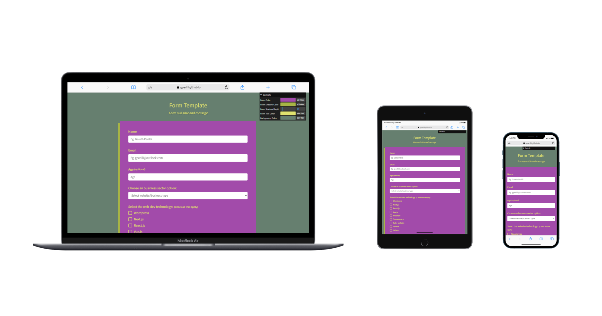

# freecodecamp projects: survey form



See the (Github pages) deploy of this project here: [https://gperilli.github.io/freecodecamp-form/](https://gperilli.github.io/freecodecamp-form/)

This is a HTML single page form created for the freecodecamp web design course: [https://www.freecodecamp.org/learn/2022/responsive-web-design/](https://www.freecodecamp.org/learn/2022/responsive-web-design/). The main index page allows for some basic colour and box-shadow editing.


## Built With
- [JS](https://developer.mozilla.org/en-US/docs/Web/JavaScript)
- [CSS](https://developer.mozilla.org/en-US/docs/Web/CSS)
- [HTML](https://developer.mozilla.org/en-US/docs/Web/HTML)
- [node](https://nodejs.org/en/download)
- [lil-gui](https://lil-gui.georgealways.com/)

## Getting the project files

Either do a direct download using the download option from the code button dropdown near the top of this Github page, or use a git clone command:
```sh
git clone git@github.com:gperilli/form.git
cd freecodecamp-form
```
<br>

For more information on getting git (version control system) on your local machine, see [this](https://git-scm.com/book/en/v2/Getting-Started-Installing-Git).

## Set Up a Local Development Environment

The web app will run directly on any modern web browser by opening the `index.html` file.
Editing the code can be done with a simple text edtitor, or something like [Notepad++](https://notepad-plus-plus.org/). [VSCode](https://code.visualstudio.com/), probably the most popular code editor these days, can be used with the Live Server plugin which allows for near-real-time monitoring for the HTML and CSS edits.

Run npm install to install the lil-gui package:
```sh
npm install
```
Node (and npm) is required to handle Javascript packages, and run the npm command above from the command line.
Check you have them installed:
```sh
node -v
npm -v
```
